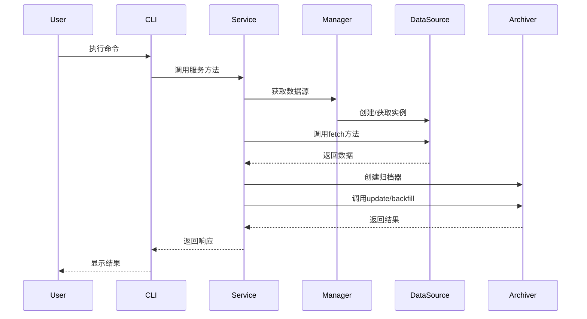
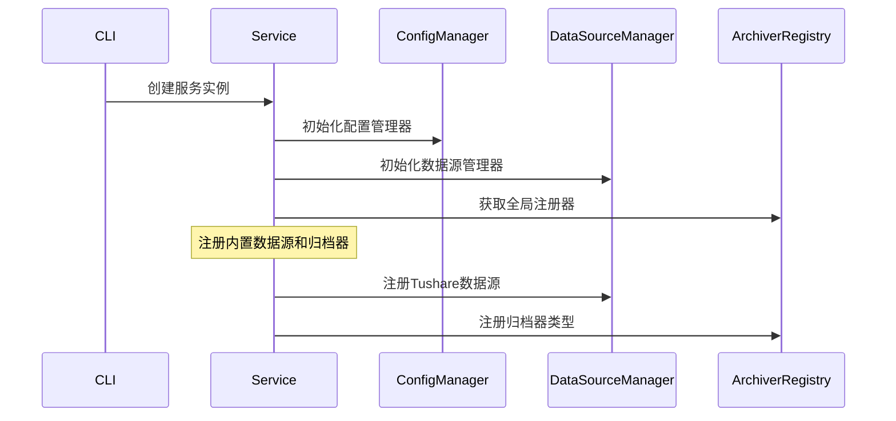

# Raw数据层架构详解

## 目录
- [1. 架构概览](#1-架构概览)
- [2. 核心设计理念](#2-核心设计理念)
- [3. 模块详细分析](#3-模块详细分析)
- [4. 调度关系与数据流](#4-调度关系与数据流)
- [5. 扩展机制](#5-扩展机制)
- [6. 使用示例](#6-使用示例)
- [7. 最佳实践](#7-最佳实践)

## 1. 架构概览

### 1.1 整体架构图

```
┌─────────────────────────────────────────────────────────────┐
│                        CLI Layer                            │
│  ┌─────────────┐  ┌─────────────┐  ┌─────────────────────┐  │
│  │ cli.py      │  │ manager.py  │  │ __main__.py         │  │
│  └─────────────┘  └─────────────┘  └─────────────────────┘  │
└─────────────────────────────────────────────────────────────┘
                              │
                              ▼
┌─────────────────────────────────────────────────────────────┐
│                      Service Layer                          │
│  ┌─────────────────────────────────────────────────────────┐ │
│  │              RawDataService                             │ │
│  │  • 业务逻辑封装                                          │ │
│  │  • 统一错误处理                                          │ │
│  │  • 数据流控制                                            │ │
│  └─────────────────────────────────────────────────────────┘ │
└─────────────────────────────────────────────────────────────┘
                              │
                              ▼
┌─────────────────────────────────────────────────────────────┐
│                       Core Layer                            │
│  ┌─────────────┐  ┌─────────────┐  ┌─────────────────────┐  │
│  │DataSource   │  │Archiver     │  │   Managers          │  │
│  │Manager      │  │Factory      │  │ • ConfigManager     │  │
│  └─────────────┘  └─────────────┘  │ • DataSourceManager │  │
│                                    └─────────────────────┘  │
│  ┌─────────────────────────────────────────────────────────┐ │
│  │                    DTO Layer                            │ │
│  │  ┌─────────────┐           ┌─────────────────────────┐  │ │
│  │  │ requests.py │           │      responses.py       │  │ │
│  │  └─────────────┘           └─────────────────────────┘  │ │
│  └─────────────────────────────────────────────────────────┘ │
└─────────────────────────────────────────────────────────────┘
                              │
                              ▼
┌─────────────────────────────────────────────────────────────┐
│                    Sources Layer                            │
│  ┌─────────────┐  ┌─────────────┐  ┌─────────────────────┐  │
│  │  Tushare    │  │ EastMoney   │  │     Template        │  │
│  │ DataSource  │  │ DataSource  │  │   (for extension)   │  │
│  └─────────────┘  └─────────────┘  └─────────────────────┘  │
└─────────────────────────────────────────────────────────────┘
```

### 1.2 分层职责

| 层级 | 职责 | 主要组件 |
|------|------|----------|
| CLI Layer | 用户交互、命令解析 | cli.py, manager.py |
| Service Layer | 业务逻辑、流程控制 | RawDataService |
| Core Layer | 核心抽象、管理器 | BaseDataSource, BaseArchiver, Managers |
| DTO Layer | 数据传输对象 | requests.py, responses.py |
| Sources Layer | 具体数据源实现 | TushareDataSource, etc. |

## 2. 核心设计理念

### 2.1 设计原则

#### 单一职责原则 (SRP)
- 每个模块只负责一个特定的功能
- 数据源只负责数据获取，归档器只负责数据存储
- 管理器只负责组件的注册和生命周期管理

#### 开闭原则 (OCP)
- 通过抽象基类定义接口，对扩展开放
- 新增数据源无需修改现有代码
- 支持插件化的归档器扩展

#### 依赖倒置原则 (DIP)
- 高层模块不依赖低层模块，都依赖抽象
- Service层依赖Core层的抽象接口
- 具体实现在Sources层

#### 接口隔离原则 (ISP)
- 定义细粒度的接口
- 客户端不依赖不需要的接口

### 2.2 架构模式

#### 分层架构 (Layered Architecture)
- 清晰的层次划分
- 单向依赖关系
- 便于维护和测试

#### 工厂模式 (Factory Pattern)
- ArchiverFactory负责创建归档器实例
- 支持运行时动态创建

#### 注册器模式 (Registry Pattern)
- DataSourceManager作为数据源注册中心
- ArchiverRegistry管理归档器类型

#### 策略模式 (Strategy Pattern)
- 不同数据源实现相同接口
- 运行时可切换数据源策略

## 3. 模块详细分析

### 3.1 Core Layer 核心层

#### 3.1.1 BaseDataSource (数据源抽象基类)

**作用**：
- 定义数据源的标准接口
- 规范连接管理、数据获取等操作
- 提供类型安全的抽象

**核心接口**：
```python
class BaseDataSource(Protocol):
    config: DataSourceConfig
    
    def connect(self) -> None: ...
    def disconnect(self) -> None: ...
    def validate_connection(self) -> bool: ...
    def supported_assets(self) -> Sequence[str]: ...
    def fetch(self, asset: str, **kwargs) -> Iterable[Dict[str, Any]]: ...
```

**设计亮点**：
- 使用Protocol定义接口，支持结构化子类型
- 统一的配置管理通过DataSourceConfig
- 支持资产类型声明和验证

#### 3.1.2 BaseArchiver (归档器抽象基类)

**作用**：
- 定义数据归档的标准接口
- 支持增量更新和历史回填
- 提供上下文管理

**核心接口**：
```python
class BaseArchiver(Protocol):
    context: ArchiverContext
    
    def update(self, **kwargs) -> bool: ...
    def backfill(self, start_date: str, end_date: Optional[str] = None, **kwargs) -> bool: ...
```

**设计亮点**：
- 分离更新和回填操作
- 通过ArchiverContext提供运行环境
- 返回布尔值表示操作成功状态

#### 3.1.3 DataSourceManager (数据源管理器)

**作用**：
- 数据源的注册中心
- 实例生命周期管理
- 提供查询和发现功能

**核心功能**：
```python
class DataSourceManager:
    def register_data_source(self, name: str, cls: Type[BaseDataSource], config: Optional[DataSourceConfig] = None)
    def get_data_source(self, name: str) -> Optional[BaseDataSource]
    def list_sources(self) -> Dict[str, Dict[str, Any]]
    def get_assets(self, source_name: str) -> list[str]
```

**设计亮点**：
- 懒加载实例化，节省资源
- 支持配置注入
- 提供丰富的查询接口

#### 3.1.4 ArchiverFactory (归档器工厂)

**作用**：
- 归档器的创建工厂
- 支持多种归档器类型
- 与数据源管理器协作

**核心功能**：
```python
class ArchiverFactory:
    def create_archiver(self, source_name: str, archiver_type: str, 
                       data_source_manager: DataSourceManager, **kwargs)
```

**设计亮点**：
- 全局注册器模式
- 支持运行时动态创建
- 与DataSourceManager解耦

#### 3.1.5 ConfigManager (配置管理器)

**作用**：
- 集中管理配置信息
- 支持JSON格式持久化
- 提供配置的增删改查

**核心功能**：
```python
class ConfigManager:
    def add_data_source(self, name: str, cls_name: str, config: Optional[Dict[str, Any]] = None)
    def add_archiver(self, name: str, cls_name: str, source_name: str, meta: Optional[Dict[str, Any]] = None)
    def get_config(self) -> Dict[str, Any]
```

**设计亮点**：
- 自动持久化机制
- 支持嵌套配置结构
- 线程安全的配置访问

### 3.2 DTO Layer 数据传输对象层

#### 3.2.1 Requests (请求DTO)

**作用**：
- 定义各种操作的输入参数
- 提供类型安全和参数验证
- 统一请求格式

**主要类型**：
```python
@dataclass
class BackfillDataRequest:
    source_name: str
    data_type: str
    archiver_type: str
    start_date: str
    end_date: Optional[str] = None
    extra_params: Optional[Dict[str, Any]] = None
```

**设计亮点**：
- 使用dataclass减少样板代码
- 支持可选参数和默认值
- 提供__post_init__进行参数处理

#### 3.2.2 Responses (响应DTO)

**作用**：
- 定义统一的响应格式
- 包含成功状态和错误信息
- 支持结构化的返回数据

**基础结构**：
```python
@dataclass
class BaseResponse:
    success: bool
    message: Optional[str] = None
    error: Optional[str] = None
```

**设计亮点**：
- 继承BaseResponse保证一致性
- 支持嵌套的复杂数据结构
- 提供丰富的元数据信息

### 3.3 Service Layer 服务层

#### 3.3.1 RawDataService (原始数据服务)

**作用**：
- 封装核心业务逻辑
- 协调各个组件的交互
- 提供统一的服务接口

**核心方法**：
```python
class RawDataService:
    def list_sources(self, request: ListSourcesRequest) -> ListSourcesResponse
    def backfill_data(self, request: BackfillDataRequest) -> BackfillDataResponse
    def update_data(self, request: UpdateDataRequest) -> UpdateDataResponse
    def batch_update(self, request: BatchUpdateRequest) -> BatchUpdateResponse
```

**设计亮点**：
- 使用DTO进行输入输出
- 统一的错误处理机制
- 支持批量操作
- 提供详细的执行统计

### 3.4 Sources Layer 数据源层

#### 3.4.1 TushareDataSource (Tushare数据源)

**作用**：
- 实现Tushare API的数据获取
- 提供标准化的数据接口
- 支持多种资产类型

**实现特点**：
```python
class TushareDataSource(BaseDataSource):
    def __init__(self, config: DataSourceConfig, **_: Any) -> None:
        self.config = config
        self._assets = ("cashflow_vip", "income_vip", "balancesheet_vip")
    
    def fetch(self, asset: str, **kwargs) -> Iterable[Dict[str, Any]]:
        # 委托给client层的分页器
        return get_data_with_pagination(asset, **kwargs)
```

**设计亮点**：
- 声明式的资产支持列表
- 委托给专门的客户端层
- 支持灵活的参数传递

### 3.5 CLI Layer 命令行层

#### 3.5.1 RawDataCLI (命令行接口)

**作用**：
- 提供用户友好的命令行接口
- 参数解析和验证
- 委托给服务层处理

**核心结构**：
```python
class RawDataCLI:
    def __init__(self, data_root: str = "./data", config_path: Optional[str] = None):
        self.service = RawDataService(data_root=data_root, config_path=config_path)
    
    def fetch_stock_basic(self, **kwargs):
        return self.service.fetch_stock_basic(**kwargs)
```

**设计亮点**：
- 薄层设计，主要负责参数转换
- 委托给服务层处理业务逻辑
- 保持向后兼容性

## 4. 调度关系与数据流

### 4.1 典型调用流程

#### 4.1.1 数据获取流程



#### 4.1.2 组件初始化流程



### 4.2 数据流向分析

#### 4.2.1 配置数据流

```
配置文件 (JSON) → ConfigManager → Service → 各组件
                     ↓
                运行时配置更新
                     ↓
                自动持久化保存
```

#### 4.2.2 业务数据流

```
外部数据源 → DataSource.fetch() → Service处理 → Archiver存储 → 本地文件系统
     ↑              ↓                    ↓              ↓
  API调用        标准化数据           业务逻辑        文件归档
```

### 4.3 错误处理流程

#### 4.3.1 异常传播链

```
DataSource异常 → Service捕获 → 转换为Response.error → CLI显示错误
     ↓
连接失败/数据异常
     ↓
记录日志并返回失败状态
```

#### 4.3.2 重试机制

```python
# 在Service层实现重试逻辑
def _with_retry(self, operation, max_retries=3):
    for attempt in range(max_retries):
        try:
            return operation()
        except Exception as e:
            if attempt == max_retries - 1:
                raise
            time.sleep(2 ** attempt)  # 指数退避
```

## 5. 扩展机制

### 5.1 新增数据源

#### 5.1.1 实现步骤

1. **创建数据源类**：
```python
class NewDataSource(BaseDataSource):
    def __init__(self, config: DataSourceConfig, **kwargs):
        self.config = config
        # 初始化连接等
    
    def connect(self) -> None:
        # 实现连接逻辑
        pass
    
    def fetch(self, asset: str, **kwargs) -> Iterable[Dict[str, Any]]:
        # 实现数据获取逻辑
        pass
```

2. **注册数据源**：
```python
def register_new_source(manager: DataSourceManager):
    config = DataSourceConfig(
        name="new_source",
        version="1.0.0",
        description="新数据源"
    )
    manager.register_data_source("new_source", NewDataSource, config)
```

3. **创建归档器**：
```python
class NewSourceArchiver(BaseArchiver):
    def update(self, **kwargs) -> bool:
        # 实现更新逻辑
        pass
    
    def backfill(self, start_date: str, end_date: Optional[str] = None, **kwargs) -> bool:
        # 实现回填逻辑
        pass
```

### 5.2 自定义归档策略

#### 5.2.1 归档器类型

- **PeriodArchiver**: 按时间周期归档
- **SnapshotArchiver**: 快照式归档
- **IncrementalArchiver**: 增量归档
- **CustomArchiver**: 自定义归档逻辑

#### 5.2.2 扩展示例

```python
class CustomArchiver(BaseArchiver):
    def __init__(self, base_path: Union[str, Path], asset_name: str, **kwargs):
        self.context = ArchiverContext(
            base_path=Path(base_path),
            asset_name=asset_name
        )
        self.custom_config = kwargs.get('custom_config', {})
    
    def update(self, **kwargs) -> bool:
        # 自定义更新逻辑
        data_source = kwargs.get('data_source')
        data = data_source.fetch(self.context.asset_name)
        
        # 自定义处理逻辑
        processed_data = self._custom_process(data)
        
        # 保存数据
        return self._save_data(processed_data)
```

### 5.3 插件化架构

#### 5.3.1 插件发现机制

```python
def discover_plugins(plugin_dir: Path):
    """自动发现并加载插件"""
    for plugin_file in plugin_dir.glob("*.py"):
        spec = importlib.util.spec_from_file_location(plugin_file.stem, plugin_file)
        module = importlib.util.module_from_spec(spec)
        spec.loader.exec_module(module)
        
        # 查找并注册插件
        if hasattr(module, 'register_plugin'):
            module.register_plugin()
```

#### 5.3.2 插件接口规范

```python
# plugin_interface.py
class PluginInterface(Protocol):
    name: str
    version: str
    
    def register_plugin(self) -> None:
        """注册插件到系统"""
        ...
    
    def get_data_sources(self) -> List[Type[BaseDataSource]]:
        """返回插件提供的数据源"""
        ...
    
    def get_archivers(self) -> List[Type[BaseArchiver]]:
        """返回插件提供的归档器"""
        ...
```

## 6. 使用示例

### 6.1 基础使用

#### 6.1.1 命令行使用

```bash
# 列出可用数据源
python -m caiyuangungun.data.raw.cli list-sources

# 获取股票基础信息
python -m caiyuangungun.data.raw.cli fetch-stock-basic

# 回填历史数据
python -m caiyuangungun.data.raw.cli backfill \
    --source tushare \
    --data-type daily \
    --archiver-type period \
    --start-date 20240101 \
    --end-date 20240331

# 批量更新
python -m caiyuangungun.data.raw.cli batch-update --source tushare
```

#### 6.1.2 编程接口使用

```python
from caiyuangungun.data.raw.core.services import RawDataService
from caiyuangungun.data.raw.core.dto import BackfillDataRequest

# 创建服务实例
service = RawDataService(data_root="./data")

# 回填数据
request = BackfillDataRequest(
    source_name="tushare",
    data_type="daily",
    archiver_type="period",
    start_date="20240101",
    end_date="20240331"
)

response = service.backfill_data(request)
if response.success:
    print(f"成功处理 {response.records_processed} 条记录")
else:
    print(f"处理失败: {response.error}")
```

### 6.2 高级使用

#### 6.2.1 自定义配置

```python
from caiyuangungun.data.raw.core import ConfigManager, DataSourceConfig

# 创建配置管理器
config_manager = ConfigManager("./config.json")

# 添加自定义数据源配置
config_manager.add_data_source(
    name="custom_source",
    cls_name="CustomDataSource",
    config={
        "api_key": "your_api_key",
        "base_url": "https://api.example.com",
        "timeout": 30
    }
)

# 添加归档器配置
config_manager.add_archiver(
    name="custom_archiver",
    cls_name="CustomArchiver",
    source_name="custom_source",
    meta={
        "compression": "gzip",
        "format": "parquet"
    }
)
```

#### 6.2.2 批量操作

```python
from caiyuangungun.data.raw.core.dto import BatchUpdateRequest

# 批量更新所有数据源
batch_request = BatchUpdateRequest()
batch_response = service.batch_update(batch_request)

for result in batch_response.results:
    print(f"数据源 {result.source_name}: {'成功' if result.success else '失败'}")
    if not result.success:
        print(f"  错误: {result.error}")
    else:
        print(f"  处理记录数: {result.records_processed}")
        print(f"  耗时: {result.duration_seconds:.2f}秒")
```

### 6.3 监控和调试

#### 6.3.1 日志配置

```python
import logging

# 配置日志
logging.basicConfig(
    level=logging.INFO,
    format='%(asctime)s - %(name)s - %(levelname)s - %(message)s',
    handlers=[
        logging.FileHandler('raw_data.log'),
        logging.StreamHandler()
    ]
)

# 创建带日志的服务
logger = logging.getLogger("caiyuangungun.data.raw")
service = RawDataService(
    data_root="./data",
    logger=logger
)
```

#### 6.3.2 性能监控

```python
import time
from contextlib import contextmanager

@contextmanager
def performance_monitor(operation_name: str):
    start_time = time.time()
    try:
        yield
    finally:
        duration = time.time() - start_time
        print(f"{operation_name} 耗时: {duration:.2f}秒")

# 使用性能监控
with performance_monitor("数据回填"):
    response = service.backfill_data(request)
```

## 7. 最佳实践

### 7.1 设计原则

#### 7.1.1 模块化设计
- **单一职责**: 每个模块只负责一个特定功能
- **低耦合**: 模块间通过接口交互，减少直接依赖
- **高内聚**: 相关功能集中在同一模块内

#### 7.1.2 接口设计
- **一致性**: 所有数据源实现相同接口
- **可扩展性**: 接口支持未来功能扩展
- **向后兼容**: 新版本保持旧接口可用

### 7.2 性能优化

#### 7.2.1 数据获取优化
- **分页获取**: 避免一次性加载大量数据
- **并发控制**: 合理控制并发请求数量
- **缓存机制**: 缓存频繁访问的数据

```python
class OptimizedDataSource(BaseDataSource):
    def __init__(self, config: DataSourceConfig, **kwargs):
        super().__init__(config, **kwargs)
        self._cache = {}
        self._max_concurrent = kwargs.get('max_concurrent', 5)
    
    def fetch_with_cache(self, asset: str, **kwargs):
        cache_key = self._generate_cache_key(asset, kwargs)
        if cache_key in self._cache:
            return self._cache[cache_key]
        
        data = self.fetch(asset, **kwargs)
        self._cache[cache_key] = data
        return data
```

#### 7.2.2 存储优化
- **压缩存储**: 使用高效的压缩算法
- **分区存储**: 按时间或其他维度分区
- **索引优化**: 为常用查询字段建立索引

### 7.3 错误处理

#### 7.3.1 异常分类
- **网络异常**: 连接超时、网络不可达
- **数据异常**: 数据格式错误、缺失字段
- **业务异常**: 权限不足、配额超限

#### 7.3.2 重试策略
```python
class RetryConfig:
    max_retries: int = 3
    base_delay: float = 1.0
    max_delay: float = 60.0
    backoff_factor: float = 2.0

def exponential_backoff_retry(func, config: RetryConfig):
    for attempt in range(config.max_retries + 1):
        try:
            return func()
        except Exception as e:
            if attempt == config.max_retries:
                raise
            
            delay = min(
                config.base_delay * (config.backoff_factor ** attempt),
                config.max_delay
            )
            time.sleep(delay)
```

### 7.4 测试策略

#### 7.4.1 单元测试
```python
import unittest
from unittest.mock import Mock, patch

class TestDataSourceManager(unittest.TestCase):
    def setUp(self):
        self.manager = DataSourceManager()
    
    def test_register_data_source(self):
        mock_source = Mock(spec=BaseDataSource)
        config = DataSourceConfig(name="test")
        
        self.manager.register_data_source("test", mock_source, config)
        
        self.assertIn("test", self.manager._source_classes)
        self.assertEqual(self.manager._source_configs["test"], config)
    
    @patch('your_module.SomeDataSource')
    def test_get_data_source(self, mock_class):
        mock_instance = Mock()
        mock_class.return_value = mock_instance
        
        self.manager.register_data_source("test", mock_class)
        result = self.manager.get_data_source("test")
        
        self.assertEqual(result, mock_instance)
        mock_class.assert_called_once()
```

#### 7.4.2 集成测试
```python
class TestRawDataServiceIntegration(unittest.TestCase):
    def setUp(self):
        self.temp_dir = tempfile.mkdtemp()
        self.service = RawDataService(data_root=self.temp_dir)
    
    def test_end_to_end_data_flow(self):
        # 测试完整的数据流程
        request = BackfillDataRequest(
            source_name="tushare",
            data_type="stock_basic",
            archiver_type="snapshot",
            start_date="20240101"
        )
        
        response = self.service.backfill_data(request)
        
        self.assertTrue(response.success)
        self.assertGreater(response.records_processed, 0)
        
        # 验证文件是否创建
        expected_path = Path(self.temp_dir) / "stock_basic"
        self.assertTrue(expected_path.exists())
```

### 7.5 部署和运维

#### 7.5.1 配置管理
- **环境分离**: 开发、测试、生产环境使用不同配置
- **敏感信息**: API密钥等敏感信息使用环境变量
- **配置验证**: 启动时验证配置的完整性和正确性

#### 7.5.2 监控告警
```python
class MonitoringService:
    def __init__(self, alert_threshold: int = 100):
        self.alert_threshold = alert_threshold
        self.error_count = 0
    
    def record_error(self, error: Exception):
        self.error_count += 1
        if self.error_count >= self.alert_threshold:
            self.send_alert(f"错误数量达到阈值: {self.error_count}")
    
    def send_alert(self, message: str):
        # 发送告警通知
        pass
```

#### 7.5.3 数据质量监控
```python
class DataQualityMonitor:
    def validate_data_quality(self, data: pd.DataFrame) -> bool:
        checks = [
            self._check_completeness(data),
            self._check_consistency(data),
            self._check_timeliness(data)
        ]
        return all(checks)
    
    def _check_completeness(self, data: pd.DataFrame) -> bool:
        # 检查数据完整性
        return data.isnull().sum().sum() / data.size < 0.05
    
    def _check_consistency(self, data: pd.DataFrame) -> bool:
        # 检查数据一致性
        return True  # 实现具体检查逻辑
    
    def _check_timeliness(self, data: pd.DataFrame) -> bool:
        # 检查数据时效性
        return True  # 实现具体检查逻辑
```

## 总结

这个Raw数据层架构通过分层设计、抽象接口、插件化扩展等方式，构建了一个高度模块化、可扩展、易维护的数据管理系统。它不仅解决了当前的数据获取和存储需求，还为未来的功能扩展和系统演进奠定了坚实的基础。

**核心优势**：
1. **清晰的职责分离**：每个模块都有明确的职责边界
2. **强大的扩展能力**：支持新数据源和归档策略的无缝集成
3. **统一的接口设计**：提供一致的编程体验
4. **完善的错误处理**：包含重试、降级等容错机制
5. **丰富的监控能力**：支持性能监控和数据质量检查

通过学习和理解这个架构，你可以掌握现代软件系统设计的核心理念和最佳实践，为构建更复杂的系统打下坚实的基础。